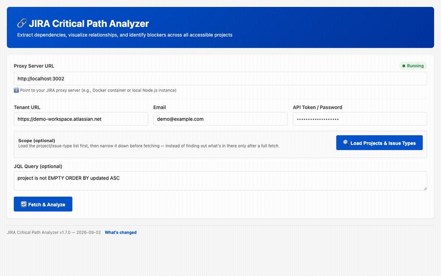

# JIRA Critical Path Analyzer

A production-ready tool to extract JIRA dependencies, visualize relationships, and identify blockers across all accessible projects.



*Demo runs against a synthetic sample dataset — not real JIRA data.*

## What's in this repo

| File | Purpose |
|---|---|
| [jira-critical-path.html](jira-critical-path.html) | Single-file client: dependency graph, table view, critical path calculation |
| [jira-proxy-server.js](jira-proxy-server.js) | Node/Express server — proxies JIRA Cloud REST API v3 (works around browser CORS) **and** serves `jira-critical-path.html` at `GET /` |
| [Dockerfile](Dockerfile) | Single-image build: one container runs both the client and the proxy API |
| [docker-compose.yml](docker-compose.yml) | Runs that one `jira-analyzer` service (host port 3000 → container 3000) |
| [package.json](package.json) | Server dependencies (`express`, `cors`, `axios`) |

## Quick start

### Option A: Docker Hub

```bash
docker run -d --name jira-analyzer -p 3000:3000 -v "$(pwd)/logs:/app/logs" \
  <your-dockerhub-username>/jira-critical-path-analyzer:latest
```

No clone needed. See [SETUP.md](SETUP.md#building--publishing-to-docker-hub) for how to
build and publish this image yourself.

### Option B: Clone and build with Docker Compose

```bash
git clone https://github.com/adambeltz2/JIRA-Critical-Path-Analyzer.git
cd JIRA-Critical-Path-Analyzer
docker compose up -d --remove-orphans
```

Requires [Docker](https://docs.docker.com/get-docker/) and Docker Compose (bundled with Docker Desktop). See [SETUP.md](SETUP.md) if you'd rather run it standalone with local Node instead of Docker.

### Then

Open `http://localhost:3000` and fill in:
- **Proxy URL:** pre-filled with the page's own origin — leave as-is
- **Tenant URL:** your Atlassian domain, e.g. `https://yourcompany.atlassian.net`
- **Email / API Token:** from [id.atlassian.com/manage-profile/security/api-tokens](https://id.atlassian.com/manage-profile/security/api-tokens)
- **JQL:** leave blank (default) to pull every issue across all projects you have access to, or scope it, e.g. `project = TMD`

Click **Fetch & Analyze**.

### Filtering to a single project

The default query (`project is not EMPTY ORDER BY updated ASC`) pulls every issue across every project you can access. To limit the fetch to one project, replace the JQL field with:

```
project = TMD ORDER BY updated ASC
```

Swap `TMD` for your project's key (visible in its issue keys, e.g. `TMD-123`). This is the same field the default query lives in — just overwrite it before clicking **Fetch & Analyze**. More JQL examples (multiple projects, status filters, date ranges) are in [SETUP.md](SETUP.md).

Full setup options (Docker Compose, standalone proxy, local Node), JQL examples, troubleshooting, and the proxy API reference live in [SETUP.md](SETUP.md).

## Architecture

```
Browser (jira-critical-path.html, served from GET /)
        │  POST /api/jira-search
        ▼
Node.js Server (port 3000) — serves the client AND proxies the API
        │  Basic Auth via HTTPS
        ▼
JIRA Cloud API (REST v3)
```

One process, one container, one port. The proxy exists solely to work around CORS — it
does not persist or transform JIRA data.

## Features

- **Dependency graph** — interactive canvas (zoom/pan/drag), color-coded nodes (regular / blocking / critical path), edge types for *blocks* vs *relates to*
- **Table view** — sortable, filterable, exportable to CSV
- **Critical path calculation** — longest chain of blocking dependencies
- **Stats** — total issues, dependencies, critical path length, blocked issue count

## Security

- Credentials are entered in the browser and passed through the proxy per-request — never logged or persisted
- Treat your JIRA API token like a password; never commit it to Git
- Use HTTPS if deploying beyond localhost

## Other docs

- [SETUP.md](SETUP.md) — detailed setup, troubleshooting, API reference
- [Changelog.md](Changelog.md) — release history
- [backlog.md](backlog.md) — known gaps and deferred work
- [CLAUDE.md](CLAUDE.md) — agent working conventions for this repo
